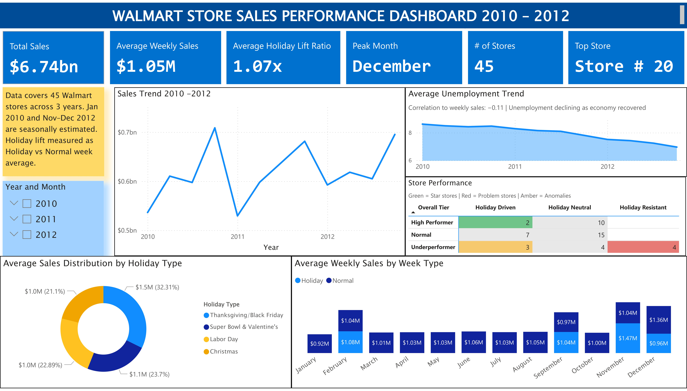
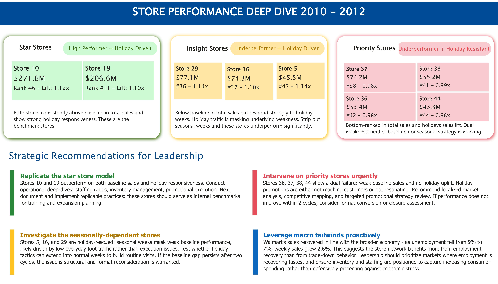
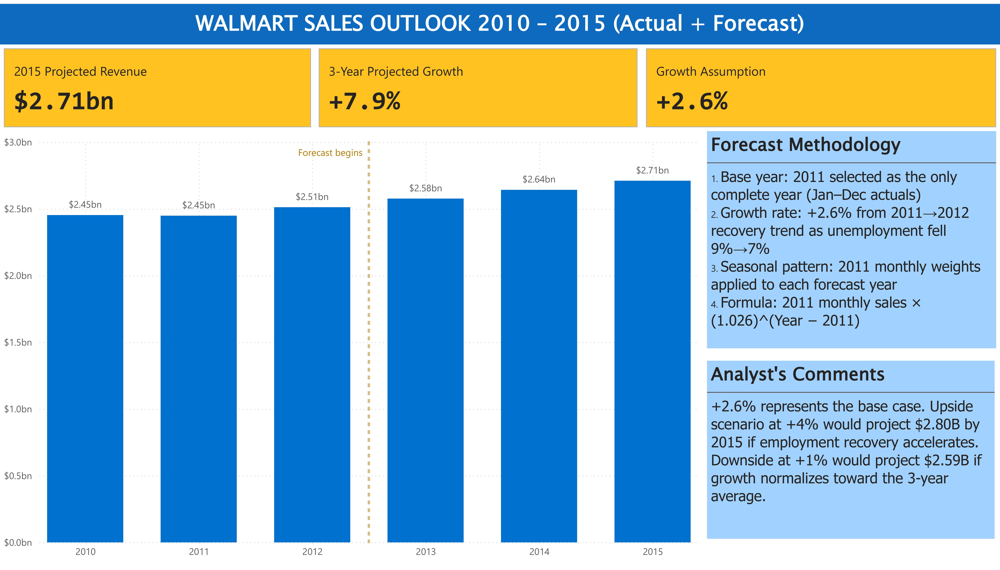

# 🛒 Walmart Store Sales Performance Dashboard
### End-to-End Retail Analytics | SQL · Excel · Power BI · DAX

**Dashboard Preview**
| Executive Overview | Store Performance | Sales Outlook |
|---|---|---|
|  |  |  |
---

## 📌 Project Overview

An end-to-end retail analytics project analyzing **45 Walmart stores across 3 years (2010–2012)** with **6,435 weekly sales records**. The project covers the full data pipeline — from raw SQL cleaning and aggregation, through Excel-based estimation and forecasting, to a 3-page interactive Power BI executive dashboard.

The dashboard was designed for a **board-level audience**: clean layout, dynamic KPI cards, interactive slicers, store performance overlap matrix, and forward-looking sales outlook — with business implications embedded directly into the analysis.

## 🔗 Live Dashboard

📊 [View Interactive Dashboard](https://app.powerbi.com/reportEmbed?reportId=726acd5f-be36-429f-8422-30da4ca44ffe&autoAuth=true&ctid=a36450eb-db06-42a7-8d1b-026719f701e3)

---
## 📂 Data Source

Raw data sourced from Kaggle's public Walmart sales dataset, widely used in data science education.
🔗 [Walmart Sales](https://www.kaggle.com/datasets/mikhail1681/walmart-sales)

- 45 stores · 3 years (2010–2012) · 6,435 weekly records
- Original columns: Store, Date, Weekly Sales, Holiday Flag, Temperature, Fuel Price, CPI, Unemployment
---

## 🖥️ Dashboard Structure

> *Built in Power BI Desktop · Walmart brand theme (#004C97 · #FFC220)*

**Page 1 — Executive Overview:**
- 📊 Sales trend line by year, quarter, month (2010–2012)
- 📅 Average monthly sales by week type — Holiday vs Normal, all 12 months
- 🍩 Average sales distribution by holiday event type (Thanksgiving, Super Bowl, New Year's Eve, etc.)
- 📉 Average unemployment trend 
- 🗂️ Store performance overlap matrix — Overall Tier × Holiday Sensitivity
- 🔢 6 dynamic KPI cards — Total Sales, Average Weekly Sales, Holiday Lift, Peak Month, Store Count, Top Store
- 🔽 Interactive Year slicer filtering all visuals simultaneously

**Page 2 — Store Intelligence:**
- 🟢 Star stores — Store 10 & 19 (High Performer + Holiday Driven)
- 🟡 Insight stores — Store 5, 16, 29 (Underperformer + Holiday Driven)
- 🔴 Priority stores — Store 36, 37, 38, 44 (Underperformer + Holiday Resistant)
- 💡 Business implications and strategic recommendations per category

**Page 3 — Sales Outlook:**
- 📈 Annual bar chart 2010–2015
- Forecast methodology panel — 4-step explanation
- Growth rate commentary — why +2.6% was selected over the flat 2010→2011 rate
- Analyst's comments

---

## 💡 Key Insights

| Insight | Finding |
|---|---|
| Holiday lift | Holiday weeks average **1.07×** normal weeks chain-wide |
| Thanksgiving | **32.31%** of holiday sales — highest contribution AND highest per-week avg at $1.5M |
| Christmas | **21.1%** contribution — lowest share, worth investigating underperformance |
| Peak month | **December** consistently highest — avg $1.4M/week |
| Star stores | Only **2 of 45** stores are both High Performers AND Holiday Driven |
| Holiday-rescued | **3 stores** are Underperformers saved by holiday traffic — fragile position |
| Priority review | **4 stores** are weak overall AND holiday resistant — dual failure |
| Macro correlation | Unemployment r = −0.11, CPI r = −0.07, Fuel Price r = +0.01 — all weak |
| Top performer | **Store #20** — highest total revenue across all 3 years |
| Forecast | At +2.6% growth, projected to reach **$2.71B by 2015** (+10.7% from 2012) |

---

## 🗂️ Data Pipeline

```
Raw CSV
   │
   ▼
MySQL (SQL cleaning & aggregation)
   │
   ▼
Excel (estimation, forecasting, classification)
   │
   ▼
Power BI (data model, DAX measures, 3-page dashboard)
```

---

## 🛠️ Step 1 — SQL Cleaning & Aggregation

**Tool:** MySQL  
**File:** `Janie Nguyen_Walmart_SQL.sql`

### What was done:
- Converted `Date` column from string to proper `DATE` format using `STR_TO_DATE()`
- Created `Week_Type` column classifying each row as `Holiday` or `Normal` based on `Holiday_Flag`
- Classified holiday events by date range — Super Bowl, Labor Day, Thanksgiving, New Year's Eve
- Built a **Sales Lift Multiplier** using a self-join on a view, calculating Holiday/Normal average ratio per store
- Created `top_stores` view ranking stores by total and average weekly sales

### Key SQL techniques used:
- `ALTER TABLE` / `UPDATE` for schema changes and data transformation
- `CREATE OR REPLACE VIEW` for reusable aggregations
- **Self-join** on the same view to calculate Holiday vs Normal lift per store
- `CASE WHEN` for conditional classification
- `STR_TO_DATE()` for data type conversion

```sql
-- Sales Lift Multiplier via self-join
SELECT n.Store,
    ROUND(h.Average_weekly_sales / n.Average_weekly_sales, 2) AS Sales_lift_multiplier
FROM Sales_by_Week_Type n
JOIN Sales_by_Week_Type h ON n.Store = h.Store
WHERE n.Week_Type = 'Normal'
AND h.Week_Type = 'Holiday'
ORDER BY Sales_lift_multiplier DESC;
```

---

## 📊 Step 2 — Excel Analysis & Estimation

**Tool:** Microsoft Excel  
**Files:** `Janie Nguyen_Walmart Sales Cleaned.xlsx`

### Challenge: Partial Year Data
The dataset had **missing months**:
- **Jan 2010** — dataset starts February 2010
- **Nov–Dec 2012** — dataset ends October 2012

Comparing raw annual totals would make 2010 and 2012 look artificially low, distorting YoY growth.

### Solution: Seasonal Decomposition
Used **2011 as the base year** (only complete year) to estimate missing months:

```
Scale Factor (2010) = 2010 actual Feb–Dec ÷ 2011 actual Feb–Dec
Estimated Jan 2010  = Jan 2011 seasonal weight × 2011 annual total × Scale Factor
```

| Estimated Period | Point Estimate | ±5% Band |
|---|---|---|
| Jan 2010 | $164,018,554 | $155.8M – $172.2M |
| Nov 2012 | $215,569,924 | $204.8M – $226.3M |
| Dec 2012 | $295,490,477 | $280.7M – $310.3M |

### Adjusted Annual Totals

| Year | Total Sales | Notes |
|---|---|---|
| 2010 | $2.45B | Jan estimated |
| 2011 | $2.45B | Full actuals |
| 2012 | $2.51B | Nov–Dec estimated |

### Store Classification
Stores classified into three tiers based on total sales across all 3 years:

| Tier | Condition | Count |
|---|---|---|
| High Performer | Top quartile by total sales | 12 stores |
| Normal | Mid range | 29 stores |
| Underperformer | Bottom quartile | 4 stores |

Holiday sensitivity classified from SQL-derived lift multiplier:

| Tier | Lift Ratio | Count |
|---|---|---|
| Holiday Driven | ≥ 1.10 | 12 stores |
| Holiday Neutral | 1.0 – 1.09 | 29 stores |
| Holiday Resistant | < 1.0 | 4 stores |

### 3-Year Forecast (2013–2015)

Extended actuals to 2015 using **seasonal decomposition + growth rate** methodology:

- 2010→2011 YoY: **−0.19%** — excluded, reflects post-recession paralysis not structural performance
- 2011→2012 YoY: **+2.57%** — selected as base, reflects genuine recovery as unemployment fell 9%→7%
- Growth rate applied: **+2.6%** compounded annually

```
Forecast Month (Year Y) = 2011 Monthly Sales × (1.026)^(Y - 2011)
```

| Year | Projected Total | Growth |
|---|---|---|
| 2013 | $2.58B | +2.6% |
| 2014 | $2.64B | +2.6% |
| 2015 | $2.71B | +2.6% |

> ⚠️ Forecast is directional only. Based on a single growth assumption. Do not present as audited projections.

---

## 📐 Step 3 — Power BI Data Model

**Tool:** Power BI Desktop  
**File:** `Janie Nguyen_Walmart Project.pbix`
**[Live View](https://app.powerbi.com/reportEmbed?reportId=726acd5f-be36-429f-8422-30da4ca44ffe&autoAuth=true&ctid=a36450eb-db06-42a7-8d1b-026719f701e3)**

### Tables imported from `Janie Nguyen_Walmart Sales Cleaned.xlsx`:
| Tab | Rows | Purpose |
|---|---|---|
| `Cleaned Data` | 6,435 | Main fact table — weekly sales, macro factors |
| `Sales by Month` | 72 | Monthly aggregated with estimates + forecast |
| `Sales Tiers by Store` | 45 | Store dimension — Overall Tier, Holiday Tier |
| `Holiday Lift Ratio` | 45 | Per-store holiday sensitivity classification |
| `Date Bridge` | 36 | DAX-created bridge table for cross-table slicer filtering |

### Data Model Architecture:
```
Date Bridge (1)
    ├──→ Cleaned Data (*)      via YearMonth key
    └──→ Sales by Month (*)    via YearMonth key

Sales Tiers by Store (1)
    └──→ Holiday Lift Ratio    via Store #
```

### Why a Date Bridge?
`Cleaned Data` has weekly rows (multiple per month per store) and `Sales by Month` has monthly rows — they can't join directly on Date. The **Date Bridge** creates a unique YearMonth key (`201001`, `201002`...) that both tables relate to, enabling a single slicer to filter all visuals simultaneously.

---

## 🧮 DAX Measures

### KPI Measures

```dax

-- Peak Month
Peak Month = 
VAR BestMonth = CALCULATE(
    SELECTEDVALUE('Cleaned Data'[Month]),
    TOPN(1, ALL('Cleaned Data'[Month]), 
         CALCULATE(AVERAGE('Cleaned Data'[Weekly Sales])), DESC))
RETURN SWITCH(BestMonth,
    1,"January", 2,"February", 3,"March", 4,"April",
    5,"May", 6,"June", 7,"July", 8,"August",
    9,"September", 10,"October", 11,"November", 12,"December")

-- Top Store
Top Store = 
"Store #" & " " & CALCULATE(
    SELECTEDVALUE('Cleaned Data'[Store]),
    TOPN(1, ALL('Cleaned Data'[Store]),
    CALCULATE(SUM('Cleaned Data'[Weekly Sales])), DESC))
```

### Matrix Conditional Formatting

```dax
-- Cell background color for Store Performance Overlap matrix
Cell Color = 
VAR OverallTier  = SELECTEDVALUE('Sales Tiers by Store'[Overall Tier])
VAR HolidayTier  = SELECTEDVALUE('Sales Tiers by Store'[Holiday Tier])
RETURN
    IF(OverallTier = "High Performer"  && HolidayTier = "Holiday Driven",   "#70C48A",
    IF(OverallTier = "Underperformer"  && HolidayTier = "Holiday Resistant","#E87A75",
    IF(OverallTier = "High Performer"  && HolidayTier = "Holiday Resistant","#F7C96E",
    IF(OverallTier = "Underperformer"  && HolidayTier = "Holiday Driven",   "#F7C96E",
    "#E8E8E8"))))
```

---

## 🧠 Business Implications & Strategic Insights

### December vs November — two different types of strength

- November has one massive week, **Thanksgiving at $1.47M**, that pulls the whole month up. But outside of that one event, November's normal weeks average just $1.04M, which is nothing special. 
- December works differently. Christmas week is actually underwhelming at $0.96M — below normal week average. But December's normal weeks are the **strongest of any month at $1.36M**, because people are naturally shopping more throughout the entire month — buying gifts, stocking up for parties, preparing for the holidays — without needing a specific event to trigger it. So when you average all of December's weeks together, it comes out higher than any other month.
- November wins on one dramatic night. December wins because every night is busy.
- Both end up as top two months, but they need completely different preparation — **November needs to nail Thanksgiving execution, December needs consistent inventory depth and staffing across all four weeks**, not just Christmas week.

---

### Not all holidays are worth the same investment

- In terms of average weekly sales contribution, Thanksgiving/Black Friday leads at 32.31% ($1.5M avg), followed by Super Bowl & Valentine's (23.7%, $1.1M), Christmas (22.89%, $1.0M), and Labor Day (21.1%, $1.0M).
- Thanksgiving dominates not just in share but in per-week value — it generates the highest average weekly revenue of any event.
- If Walmart is allocating the same promotional budget across all four events, that's a misallocation — **Thanksgiving deserves disproportionate investment**. The product lines most likely driving Thanksgiving's spike (seasonal food, beverages, household supplies) are worth analyzing to deepen those assortments ahead of peak season.

---

### Some stores are being rescued by holidays — and that's a risk

- Stores 5, 16, and 29 are Underperformers overall but show strong holiday responsiveness. Seasonal weeks are inflating their annual totals and masking weak baseline performance. 
- The likely root cause is location — these stores draw destination shoppers during holidays but haven't earned habitual everyday visits. More promotions won't fix that. The real question is **why customers don't come back between holidays***, and whether that's a competition, convenience, or in-store experience problem. If the baseline doesn't improve within two cycles, format reconsideration is warranted despite their seasonal strength.

---

### Macro factors barely move the needle

CPI, unemployment, and fuel price all show **very weak correlation** with weekly sales (r = −0.11, −0.07, +0.01). Walmart's performance is largely insulated from broader economic shifts — customers keep coming regardless of inflation or gas prices. Notably, sales recovered in line with employment improvement (2011→2012), not against it. Walmart didn't benefit from economic stress — it recovered as the economy recovered. Store execution and location appear to matter far more than any macro variable in this dataset.

---

### The two stores worth studying closely

Only Store 10 ($271.6M, 1.12x lift) and Store 19 ($206.6M, 1.10x lift) are strong on both dimensions — high overall sales and strong holiday responsiveness. Most top-revenue stores like Store 20 (the overall leader at $301.4M) are Holiday Neutral, meaning their strength comes from consistent everyday traffic alone. Stores 10 and 19 have both. That **dual strength*** is rare across 45 stores and worth a deep operational review — their practices around staffing, inventory, and promotions likely contain **lessons replicable across the broader network**.

---

## 📁 File Structure

```
walmart-sales-dashboard/
│
├── README.md
│
├── data/
│   ├── Walmart_Sales_raw.csv                             # Original raw dataset
│   └── Janie Nguyen_Walmart Sales Cleaned.xlsx           # All Excel work:
│       ├── Cleaned Data                                  # 6,435 weekly sales records
│       ├── Sales by Month                                # Monthly aggregated + estimates + forecast
│       ├── Sales Tiers by Store                          # Overall & Holiday Tier classifications
│       ├── Holiday Lift Ratio                            # Per-store holiday sensitivity
│       ├── Sales vs Macroeconomic Factors                # CPI, Unemployment, Fuel Price
│       └── Annual Sales Unadjusted                       # Raw annual totals before estimation
│
├── sql/
│   └── Janie Nguyen_Walmart_SQL.sql                      # SQL cleaning & aggregation script
│
├── powerbi/
│   └── Janie Nguyen_Walmart Project.pbix                 # 3-page Power BI dashboard
│       Live: [View Dashboard](https://app.powerbi.com/reportEmbed?reportId=726acd5f-be36-429f-8422-30da4ca44ffe&autoAuth=true&ctid=a36450eb-db06-42a7-8d1b-026719f701e3)
└── screenshots/
    ├── Janie Nguyen_Walmart Project Dashboard Preview-images-0.jpg     # Executive Overview
    ├── Janie Nguyen_Walmart Project Dashboard Preview-images-0.jpg     # Store Performance
    ├── Janie Nguyen_Walmart Project Dashboard Preview-images-0.jpg     # Sales Outlook
    └── data_model.png                                                  # Power BI model view
```
---

## 🔧 Tools & Technologies

| Tool | Usage |
|---|---|
| **MySQL** | Data cleaning, type conversion, aggregation, self-joins |
| **Microsoft Excel** | Seasonal decomposition, estimation, classification, forecasting |
| **Power BI Desktop** | Data modeling, DAX measures, 3-page interactive dashboard |
| **DAX** | KPI measures, conditional formatting, dynamic filtering |

---

## ⚠️ Data Notes

- **Estimated values**: Jan 2010 and Nov–Dec 2012 are seasonally estimated using 2011 as the base year. Clearly flagged throughout — do not present as audited figures.
- **Forecast values** (2013–2015): Based on +2.6% annual growth assumption derived from the 2011→2012 recovery trend. Directional only.
- **Raw data source**: Public Walmart sales dataset widely used in data science education.
- **Holiday classification**: Based on date ranges — some edge cases may differ from Walmart's actual promotional calendar.

---

## 👤 Author

**Janie Nguyen**  
Financial Analyst | SQL · Excel · Power BI · DAX

[](https://www.linkedin.com/in/janieanhnguyen/))
[](https://github.com/janienguyen2610)
